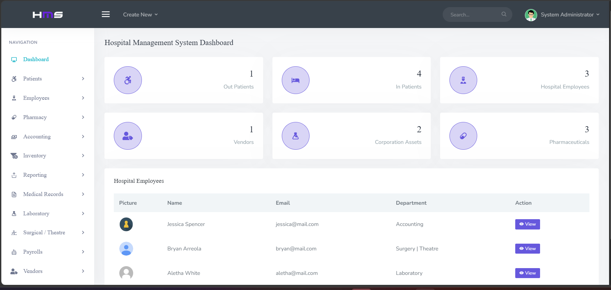
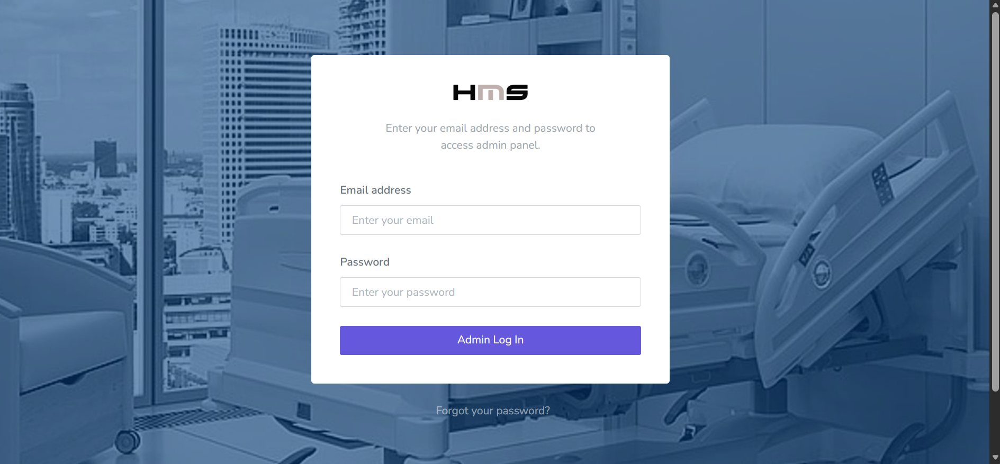
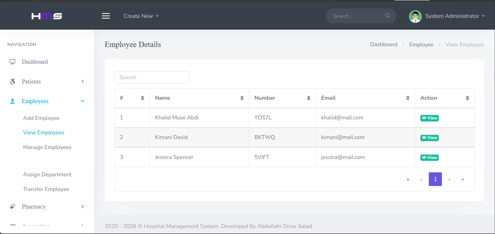
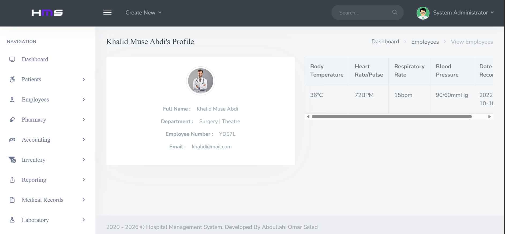

# 🏥 Hospital Management System (HMS)

<p align="center">
  
</p>

A comprehensive **Hospital Management System (HMS)** developed using **PHP**, **MySQL**, **Bootstrap**, **JavaScript**, and **jQuery**.

The system helps hospitals and healthcare facilities efficiently manage patients, doctors, pharmacy records, laboratory reports, payroll, inventory, surgery records, and medical records through a centralized web-based dashboard.

---

## 🌐 Live Demo

### Production URL

👉 https://hospitalmsys.page.gd/

---

## 🔑 Demo Credentials

### 👨‍💼 Administrator Account

**Login URL**

https://hospitalmsys.page.gd/backend/admin/

**Email**

```text
admin@mail.com
```

**Password**

```text
Password@123
```

---

### 👨‍⚕️ Doctor Account

**Login URL**

https://hospitalmsys.page.gd/backend/doc/

**Doctor ID**

```text
YDS7L
```

**Password**

```text
password
```

---

⚠️ **Note**

This is a demonstration environment intended for portfolio, educational, and learning purposes.

Please avoid modifying or deleting existing records. Demo data may be reset periodically.

---

## ✨ Features

### 👨‍⚕️ Patient Management

* Register Patients
* View Patients
* Manage Patients
* Transfer Patients
* Discharge Patients

### 🩺 Doctor & Employee Management

* Employee Registration
* Department Assignment
* Employee Transfers
* Employee Profiles

### 💊 Pharmacy Management

* Pharmaceutical Categories
* Medicine Inventory
* Prescriptions
* Vendor Management

### 🧪 Laboratory Management

* Lab Tests
* Lab Reports
* Patient Vitals
* Equipment Records

### 🏥 Surgery Management

* Surgery Scheduling
* Surgery Records
* Surgery Equipment Management

### 💰 Accounting & Payroll

* Payroll Generation
* Accounts Receivable
* Accounts Payable
* Payroll Receipts

### 📦 Inventory & Assets Management

* Asset Tracking
* Inventory Records
* Equipment Management

### 📊 Reports

* In-Patient Reports
* Out-Patient Reports
* Employee Reports
* Pharmacy Reports
* Medical Reports

---

# 📸 Screenshots

## Login Page



---

## Dashboard


---

## Employee Management



---

## Profile Management



---

# 🛠 Technology Stack

| Technology | Description               |
| ---------- | ------------------------- |
| PHP        | Backend Development       |
| MySQL      | Database Management       |
| Bootstrap  | Frontend Styling          |
| JavaScript | Client-side Functionality |
| jQuery     | UI Interactions           |
| HTML5      | Markup                    |
| CSS3       | Styling                   |

---

# 🚀 Local Installation

## Requirements

* PHP 7.4+
* MySQL / MariaDB
* Apache (XAMPP Recommended)

## Setup

### 1. Clone Repository

```bash
git clone https://github.com/caano-geel/Hospital-Management-System.git
```

### 2. Move Project

Place the project inside:

```text
C:\xampp\htdocs\
```

### 3. Create Database

Create a database named:

```text
hmisphp
```

### 4. Import Database

Import:

```text
DATABASE FILE/hmisphp.sql
```

### 5. Configure Database

Update:

```text
backend/admin/assets/inc/config.php
backend/doc/assets/inc/config.php
```

Example:

```php
<?php
$dbuser="root";
$dbpass="";
$host="localhost";
$db="hmisphp";
$mysqli=new mysqli($host,$dbuser,$dbpass,$db);
?>
```

### 6. Run Application

Start Apache and MySQL.

Open:

```text
http://localhost/Hospital-PHP/
```

---

# ☁️ Production Deployment

## Hosting Environment

* InfinityFree
* Apache
* PHP 8+
* MySQL

## Steps

1. Upload project files.
2. Create production database.
3. Import SQL database.
4. Update database credentials.
5. Configure production settings.
6. Enable HTTPS.
7. Test all modules.

---

# 📂 Main Modules

* Dashboard
* Patient Management
* Employee Management
* Pharmacy
* Laboratory
* Surgery
* Payroll
* Accounting
* Medical Records
* Inventory Management
* Vendor Management
* Reporting System

---

# 👨‍💻 Developer

### Abdullahi Omar Salad

Software Engineer

**GitHub**
https://github.com/caano-geel

**Email**
[abdullahiomarsalad@gmail.com](mailto:abdullahiomarsalad@gmail.com)

**Location**
Nairobi, Kenya

---

# 🙏 Credits

**Original Project Author**
Martin Mbithi Nzilani

**Maintained & Deployed By**
Abdullahi Omar Salad

---

# 📜 License

This project is provided for educational, learning, portfolio, and healthcare management purposes.

---

⭐ If you find this project useful, please consider giving it a star on GitHub.
